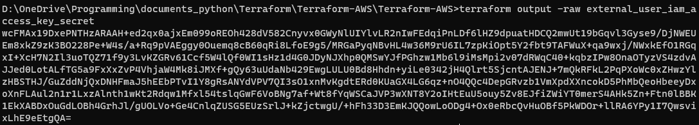
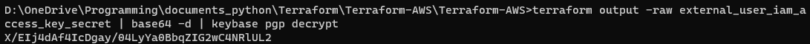
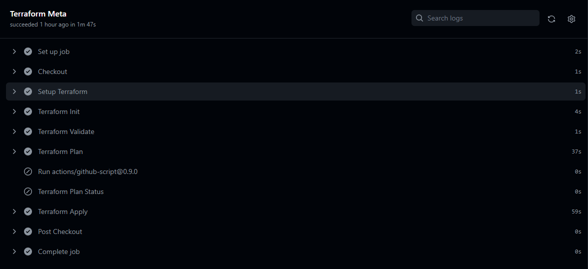
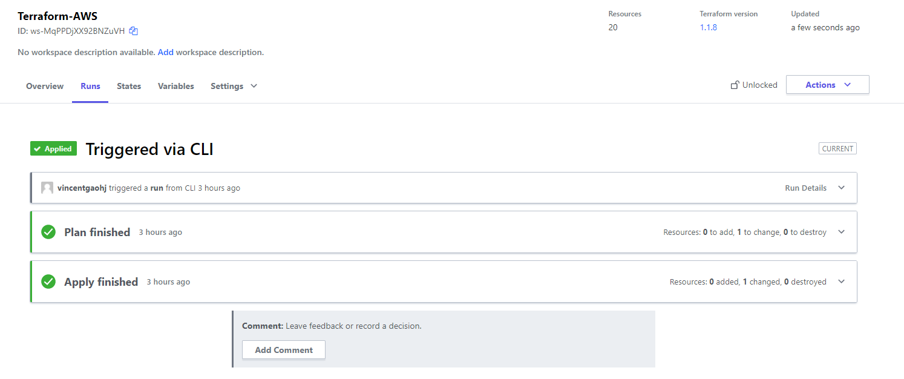
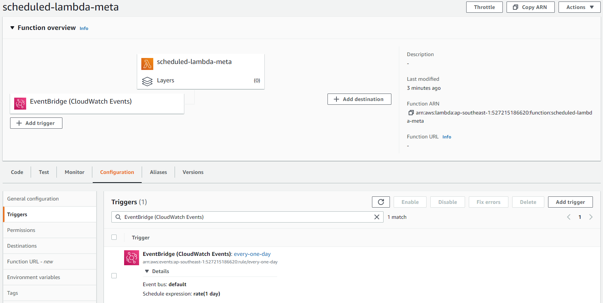

# Terraform-AWS

This repository is aim to create AWS Cloud Resources through Terraform and orchestrate them as a solution architecture.

[toc]

## 1. Requirements

### 1.2 Fundamental Requirements

- A new S3 bucket
- An IAM user for external use with proper permission
    - `GetObject` from bucket `s3://<bucket_name>/downloads/`
    - `PutObject` to bucket `s3://<bucket_name>/uploads/`
- An IAM role for internal use having full control of the bucket
- An internal user that assume above internal IAM role
- Create AK/SKs for both internal and external user, and SK cannot store on `terraform state` in plain text form.

### 1.1 Advanced Requirements

- Manage above resources using `terraform module`
- Create multiple external user, and each user can only:
    - Read from `s3://<bucket_name>/downloads/<username>/` and `s3://<bucket_name>/downloads/common/`
    - Write to `s3://<bucket_name>/uploads/<username>`
- Deploy code to `Github` private repository and configure CI/CD.
- Assume that we have 100 IAM user now, manage them through terraform.
- Create a Lambda, and schedule it to sync data:
    - From `s3://<another_bucket>/data/`
    - To `s3://<bucket_name>/downloads/common/`


---

## 2. Prerequisite

- A GitHub account
    - Access key ID & Secret Access Key of that account
    - An AWS IAM role with S3 permissions
- A Terraform Cloud account
- Need to install `Keybase` in our local


---

## 3. Folder Structure

- `main.tf`: It contains the main set of the module’s configurations.
- `variable.tf`: Access key, Secret key, and Region will be defined here.
- `output.tf`: Output resources of all module.
- `src` folder: for all code
    - `s3`: Module that have the S3 configuration
        - `bucket.tf`: Define bucket and related resources
        - `var.tf`: Define variables
        - `output.tf`: Output resources of `s3` module
        - `multiple_users.tf`: Define resources to handling multiple users with respected policy.
    - `sync` folder: Module that define sync lambda between buckets
        - `src` folder: Source code of lambda
            - `schedule_sync.py`: python source code (contain lambda_handler)
        - `bucket.tf`: Define source bucket resources, since target bucket is managed by another module
        - `data.tf`: Define data source, such as policy documentation
        - `lambda.tf`: Define lambda and related resources
        - `output.tf`: Contain output of `sync` module
        - `var.tf`: Define variables within module
- `exist_user.tf`: Define resources outside terraform and awaited to be imported
- `import_user.sh`: Automate import since no related command line provided by terraform for bulk import
- `static` folder: Image for README
- `.github/workflow/terraform.yaml`: GitHub Action


---

## 4. Key Implementation

### 4.1 Pgp key in terraform

- need to create Keybase key by using
  ```shell
  keybase pgp gen
  ```
- then give the reference of this Keybase key in your terraform code keybase:username_of_keybase
- Then terraform apply
- Then we need to get the decrypted password

  ```shell
  terraform output -raw password | base64 --decode | keybase pgp decrypt
  ```
    - for `external_user_iam_access_key_secret`
  ```shell
  terraform output -raw external_user_iam_access_key_secret | base64 -d | keybase pgp decrypt
  ```


**By using Keybase, secret had been transformed by `base64` and Keybase,** 



**And decrypted secret:**




### 4.2 Manage existing resources(Users)

**Common solution**

- Create those users in Terraform
- Import those users into your Terraform state
- Run terraform plan until it returns no changes
- Commit to source control

*But for now, The command currently can only import one resource at a time. This means you can't yet point Terraform imports to an entire collection of resources such as an AWS VPC and import all of it. This workflow will be improved in a future version of Terraform.*


**To manage massive predefined resources in Terraform, I wrote a `.sh` file to run multiple import.**

For bulk import run `import_user.sh`:


### 4.3 CI/CD on Git Action

**Steps**

- Set up Terraform Cloud using API Driven workflow
- Set up a GitHub repository
  - Create a new secret named `TF_API_TOKEN`, setting the Terraform Cloud API token you created in the previous step as the value.
- Setup Actions workflow
  - [`main.tf`](https://github.com/hashicorp/learn-terraform-github-actions/blob/main/main.tf) contains the configuration to use Terraform Cloud
  - [`.github/workflows/terraform.yml`](https://github.com/hashicorp/learn-terraform-github-actions/blob/main/.github/workflows/terraform.yml) defines the Actions workflow.


**In GitHub Action, action will be invoke when push and PR:**




**And in Terraform Cloud:**




**Resources has been created successfully in AWS Cloud.**


### 4.4 Setup AWS Schedule Event with Terraform

With CloudWatch events we can trigger Lambda’s on recurring schedules that we define.

**Resources**

- CloudWatch Event Rule — The way that we’ll setup our scheduling.
- CloudWatch Target — How we’ll tell our scheduler to call our Lambda.
- Lambda Permission — We’ll allow the Lambda to be invoked by the CloudWatch Event.

**Steps**

- Setup CloudWatch event rule
- Set lambda CloudWatch  event target
- Set AWS lambda permissions




## 5. Terraform script

- Initialize the working directory
    ```shell
    terraform init
    ```
- Script verification
    ```shell
    terraform plan
    ```
- To create your S3 bucket
    ```shell
    Terraform apply
    ```
- To destroy the S3 bucket
    ```shell
    terraform destroy
    ```

***After GitHub Action has been set, there is no need to manually run above command line.***


## 6. Issues

*Below are some technical debt during the implementation:*

**Destroy AWS resources of a failed/canceled Terraform apply, There are no good solutions at the moment. Your only options are ugly workarounds such as:**

  - Manually find everything that got deployed, delete it, and re-run `terraform apply`.
  - Manually find everything that got deployed, and for each such resource, run `terraform import`.
  - GitHub
    Track: [Incremental backend persistence during Terraform operations](https://github.com/hashicorp/terraform/issues/20718)


---

## 7. Reference

- [How To Create AWS S3 Bucket Using Terraform](https://www.bacancytechnology.com/blog/aws-s3-bucket-using-terraform)
- [A Terraform module that creates a tagged S3 bucket and an IAM user/key with access to the bucket](https://github.com/turnerlabs/terraform-s3-user)
- [How to Use PGP to Encrypt Your Terraform Secrets](https://menendezjaume.com/post/gpg-encrypt-terraform-secrets/)
- [Developing a CI/CD pipeline to provision an AWS infrastructure using Terraform, GitHub, and Ubuntu 20.04](https://sasye.medium.com/developing-a-ci-cd-pipeline-to-provision-an-aws-infrastructure-using-terraform-github-and-ubuntu-3d74c58a373e)
- [Automate Terraform with GitHub Actions](https://learn.hashicorp.com/tutorials/terraform/github-actions?in=terraform/automation)
- [Deploying AWS Lambda with Terraform Quick Tutorial and Basic Concepts](https://lumigo.io/aws-lambda-deployment/aws-lambda-terraform/#lambdaalias)
- [HOW TO SETUP AWS LAMBDA SCHEDULED EVENTS WITH TERRAFORM](https://openupthecloud.com/terraform-lambda-scheduled-event/)