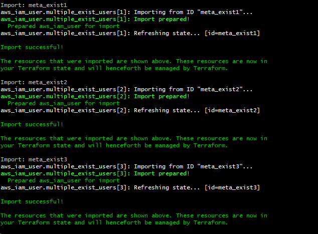

# Terraform-AWS

This repository is aim to create AWS Cloud Resources through Terraform and orchestrate them as a solution architecture.

## 1. Requirements

### 1.2 Fundamental Requirements

- A new S3 bucket
- An IAM user for external use with proper permission
    - `GetObject` from bucket `s3://<bucket_name>/downloads/`
    - `PutObject` to bucket `s3://<bucket_name>/uploads/`
- An IAM role for internal use having full control of the bucket
- An internal user that assume above internal IAM role
- Create AK/SKs for both internal and external user, and SK cannot store on `terraform state` in plain text form.

### 1.1 Advanced Requirements

- Manage above resources using `terraform module`
- Create multiple external user, and each user can only:
    - Read from `s3://<bucket_name>/downloads/<username>/` and `s3://<bucket_name>/downloads/common/`
    - Write to `s3://<bucket_name>/uploads/<username>`
- Deploy code to `Github` private repository and configure CI/CD.
- Assume that we have 100 IAM user now, manage them through terraform.
- Create a Lambda, and schedule it to sync data:
    - From `s3://<another_bucket>/data/`
    - To `s3://<bucket_name>/downloads/common/`

---

## 2. Prerequisite

- A GitHub account
    - Access key ID & Secret Access Key of that account
    - An AWS IAM role with S3 permissions
- A Terraform Cloud account
- Need to install `Keybase` in our local

---

## 3. Folder Structure

- `main.tf`: It contains the main set of the module’s configurations.
- `variable.tf`: Access key, Secret key, and Region will be defined here.
- `src` folder: for all code
    - `s3`: Module that have the S3 configuration
        - `bucket.tf`: Define bucket
        - `var.tf`: Define variables

---

## 4. Implementation

### 4.1 Create an S3 bucket using Terraform

### 4.2 Pgp key in terraform

- need to create Keybase key by using
  ```shell
  keybase pgp gen
  ```
- then give the reference of this Keybase key in your terraform code keybase:username_of_keybase
- Then terraform apply
- Then we need to get the decrypted password

  ```shell
  terraform output -raw password | base64 --decode | keybase pgp decrypt
  ```
    - for `external_user_iam_access_key_secret`
  ```shell
  terraform output -raw external_user_iam_access_key_secret | base64 -d | keybase pgp decrypt
  ```

### Manage existing resources(Users)

- Create those users in Terraform
- Import those users into your Terraform state
- Run terraform plan until it returns no changes
- Commit to source control

But for now, The command currently can only import one resource at a time. This means you can't yet point Terraform
imports to an entire collection of resources such as an AWS VPC and import all of it. This workflow will be improved in
a future version of Terraform.

### CI/CD on Git Action

For bulk import run `import_user.sh`:



## Terraform script

- Initialize the working directory
    ```shell
    terraform init
    ```
- Script verification
    ```shell
    terraform plan
    ```
- To create your S3 bucket
    ```shell
    Terraform apply
    ```
- To destroy the S3 bucket
    ```shell
    terraform destroy
    ```

# Issues

Below are some technical debt during the implementation:

- Destroy AWS resources of a failed/canceled Terraform apply, There are no good solutions at the moment. Your only
  options are ugly workarounds such as:
    - Manually find everything that got deployed, delete it, and re-run `terraform apply`.
    - Manually find everything that got deployed, and for each such resource, run `terraform import`.
    - GitHub
      Track: [Incremental backend persistence during Terraform operations](https://github.com/hashicorp/terraform/issues/20718)

---

# Reference

- [How To Create AWS S3 Bucket Using Terraform](https://www.bacancytechnology.com/blog/aws-s3-bucket-using-terraform)
- [A Terraform module that creates a tagged S3 bucket and an IAM user/key with access to the bucket](https://github.com/turnerlabs/terraform-s3-user)
- [How to Use PGP to Encrypt Your Terraform Secrets](https://menendezjaume.com/post/gpg-encrypt-terraform-secrets/)
- [Developing a CI/CD pipeline to provision an AWS infrastructure using Terraform, GitHub, and Ubuntu 20.04](https://sasye.medium.com/developing-a-ci-cd-pipeline-to-provision-an-aws-infrastructure-using-terraform-github-and-ubuntu-3d74c58a373e)
- [Automate Terraform with GitHub Actions](https://learn.hashicorp.com/tutorials/terraform/github-actions?in=terraform/automation)
- [Deploying AWS Lambda with Terraform Quick Tutorial and Basic Concepts](https://lumigo.io/aws-lambda-deployment/aws-lambda-terraform/#lambdaalias)